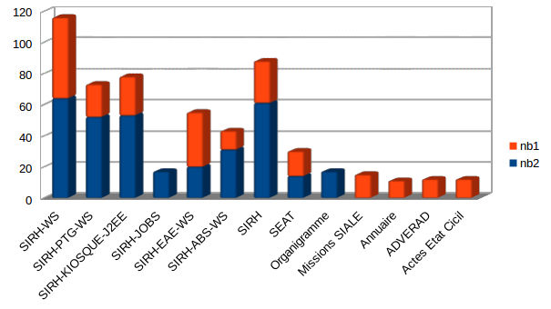
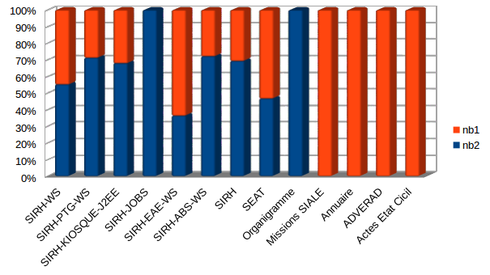
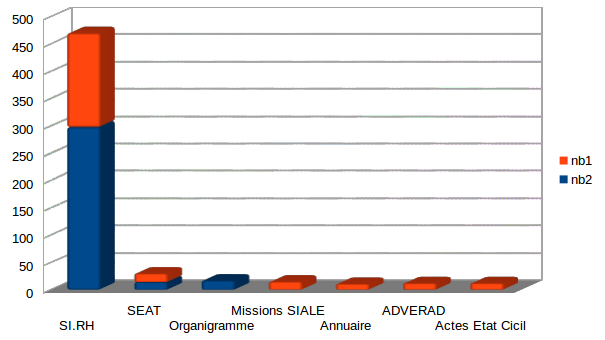
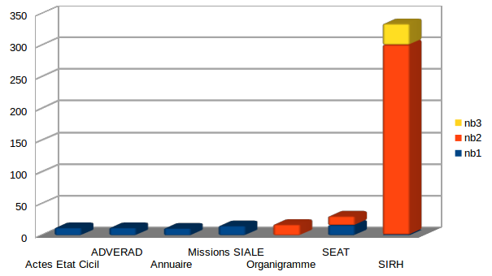
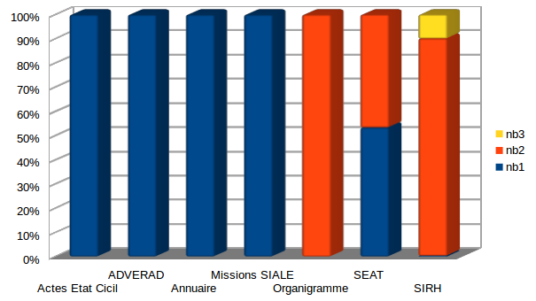
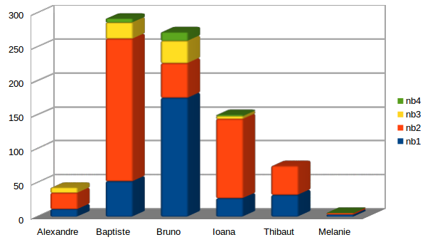
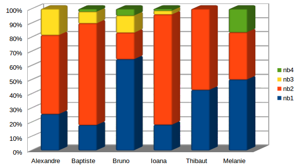

title: Optimisation des déploiements de war
author:
  name: Adrien Sales
output: index.html
controls: true
theme: sudodoki/reveal-cleaver-theme
--

Démploiements de WAR (only)

## Le choc de simplification

--

### Philosophie de fond (LEAN)

Sera omniprésent le souci, à chaque itération de ce chantier collaboratif, proposer
des sources d'amélioration continue, opérationelles et simples à mettre en oeuvre
et dont les bénéfices seront mesurables.

--

### Glossaire

* KPI : Key Performance Indicator

--

### Objectifs : Protocole de déploiement

* Garantir la compréhension, l'uniformité et le respect du protocole
* Référencer simplement au sein de documents partagés et versionés une pratique commune
* Identifier les sources de simplification, exemples de déploiements à l'appui
* Faire le point sur l'existant : performance de ce processus

--

### Pourquoi le déploiement d'un war (war only)

* Action très simple et atomique
* Facilement documentable
* Très bon point de départ pour comprendre le fonctionnement d'un Tomcat
* Gros potentiel d'optimisation à moindres frais

--

### KPI

* Construction des KPI : détail et complexité de la construction
* Pose des KPI
* Analyse des KPI
* Amélioration de la production de ces KPI (facilité, précision, transparnce, opprtunités, ...)

--

### Perspectives opérationelles

* Proposer des sources d'amélioration continue, opérationelles et simples à mettre en oeuvre
* Recherche de pistes d'optimisation
* Recherche des tâches automatisables
* Perspectives DevOps

--

### Constat actuel

* Les procédures ne sont pas partagés au sein du SIE-Infra : différences entres agents
* La méthode de déploiements se base sur des tickets passés et non sur une méthode centralisée
* Le processus n'est pas forcément compris dans son ensemble par tous (fonctionnement d'un Tomcat, et du cluster)

--

### Prérequis

Afin que ces actions soient menées efficacement et que les bénéfices
persistent dans le temps, besoin de :

* disponibilité (négociée) des acteurs
* légitimité des leaders/référents
* respect des engagements

Sans cela, inutile de se lancer dans ce processus.

--

### Prérequis : Rôles : leader

Adrien

* Leader du projet dans son ensemble
* Visu et partage de la trajectoire dans son ensemble
* Insuffler la philosophie DevOps (organisation, outils)
* Challenger les parties prenantes sur une montée en compétences
progressive, qui sera valorisée en continu
* Animer l'équipe

--

### Prérequis : Rôles : Référent Infra 

(Thibaut ?)

* Responsabilité de veiller à la bonne application des procédures mises en place en commun
* Légtimité en cas de non application des procédures développées
* Leader infra sur ce sujet

--

## Equipe

* Devs et Ops : pas de distingo presta/agent mairie
* Respect strict des procédures développées ensembles
* Ouverture d'esprit sur l'innovation
* Nécessité et volonté de comprendre ce qui est fait et pourquoi
* Reconnaissance du Leader projet et référent infra

--

### Code de conduite 1/2

* Nécessité absolue de toujours comprendre et maîtriser ce que l'on fait et pourquoi
* Utiliser les logiciels au mieux et pour quoi ils ont été conçus
* On le clique pas : on scripte ! toujours, pour tout ! (pas de oui mais ;-p)
* On travaille sous linux (on ne "rebondit" pas sur Windows)
* On utilise les outils adaptés (curl, wget, outils cli, scripts)

--

### Code de conduite 2/2

* On versionne, tout, toujours, tout le temps
* Faire les choses en continu doit être une obsession
* On ne fait pas de mail
* Quand on argumente c'est à l'aide de chiffres calculés de manière
transparente (possibilité de créer des dashboard avec ces indicateurs)
réutilisables par la suite
* "Pair deploying Dev&Ops" : on bouge physiquement bouger au cours de sessions devOps pour partager un même espace de travail

--

## Startup !

A compter de ce slide, on considère que tout le monde est OK avec les
slides précédents et que :

* le leader a légitimité
* le référent infra a légitimité

Sans cela, le chantier s'arrête là.
--

--

### Construction des datas

Création d'une table (psql) de load

<pre><code>select assignee, aggreg_time, count(*)
from deploy_war_only
group by assignee, aggreg_time
CREATE TABLE public.deploy_war_only  ( 
    id             int4 NULL,
    prio           varchar NULL,
    assignee       varchar NULL,
    temps          numeric NULL,
    application    varchar NULL,
    aggreg_time    int4 NULL
    )</code></pre>

--

### Chargement du rapport redmine (csv)

<pre><code>copy deploy_war_only from '/tmp/issues.csv' DELIMITER ';' CSV;</code></pre>

--

### BINs de temps

Bin de temps : aggre_time

* 4 : strictement supérieur à une heure
* 3 : stricement supérieur à 30 ' mais inférieur à 1h
* 2 : entre 15' et 30 '
* 1 : moins de 15' (la cible)

--

### BINs de temps

Mise à jour de la table :

<pre><code>update deploy_war_only
set aggreg_time=4 where (temps > 1);
update deploy_war_only
    set aggreg_time=3 where (temps > 0.5 and temps <= 1);
update deploy_war_only
    set aggreg_time=2 where (temps > 0.25 and temps <= 0.5);
update deploy_war_only
    set aggreg_time=1 where (temps <= 0.25)</code></pre>

--

### Famille d'applications

Créer des familles d'application pour mieux comprendre où part le temps :

<pre><code>ALTER TABLE "public"."deploy_war_only" 
    ADD COLUMN "project_family" varchar(25) NULL;

update deploy_war_only
    set project_family = application;
update deploy_war_only
    set project_family = 'SIRH'
    where application like 'SIRH%';</code></pre>

--

### Premiers retours sur la constituion des datas

* Long à mettre en oeuvre
* ne se met pas à jour en continu
* N'a jamais été produit sous cette forme
* Très enrichissant et saisissant

--

### Pistes d'amélioration continue

* Création d'un univers BI pointant sur Redmine permettant de produire et de
suivre ces métriques en continu
* Possibilité de poser des baselines

--

### Les plus gros déployeurs

Personnes qui ont fait le plus de déploiement war-only à ce jour

<pre><code>select assignee "Agent", count(*) "Nb. Déploiements"
from deploy_war_only
where assignee not in ('David MAJOREL', 'Melanie Gault',
'dimitri fortin')
group by assignee
order by count(*) desc</code></pre>

<pre>
Baptiste Jammet        292
bruno quinquis         272
ioana draghici         150
Thibaut De Casabianca  75
alexandre FAULLE       43
</pre>

--

### Volume total de déploiement /agent

</img>

--

### Questions  sur cette répartition

* Répartition actuelle et celle souhaitée à terme
* Stratégie ?
* Ressenti des gens par rapport au volume, la répartition, la complexité, la charge

--

### Distibution de la complexité des déploiements

<pre><code>
select aggreg_time, count(aggreg_time)
from deploy_war_only
group by aggreg_time
order by aggreg_time desc</code></pre>

<pre>
aggreg_time count
4             25
3             72
2             453
1             322
</pre>

--

### Distribution des temps de déploiement

--

## Objectif de la mission

Basculer les deploiements de 30' en 15', on passe d'un volume d'heures de
306 à 193, soit un facteur 1.6. A priori au vu des distribs cet objectifs
est atteignable.

--

### Distrib des temps/appli

Nb de deploiements avec temps (avec cut à 10)

<pre><code>select application, aggreg_time, count(aggreg_time)
from deploy_war_only
group by application, aggreg_time
having count(*) > 10
order by application desc, count(*) desc</code></pre>

--

<pre>
application	aggreg_time	count
SIRH-WS           2               64
SIRH-WS           1               52
SIRH-PTG-WS       2               52
SIRH-PTG-WS       1               21
SIRH-KIOSQUE-J2EE 2               53
SIRH-KIOSQUE-J2EE 1               25
SIRH-JOBS         2               17
SIRH-EAE-WS       1               35
SIRH-EAE-WS       2               20
SIRH-ABS-WS       2               31
SIRH-ABS-WS       1               12
SIRH              2               61
SIRH              1               27
SEAT              1               16
SEAT              2               14
Organigramme      2               17
Missions SIALE    1               15
Annuaire          1               11
ADVERAD           1               12
Actes Etat Cicil  1               12
</pre>

--

## Aggrégat par appli et pivoté

<pre>
application        nb2     nb1
SIRH-WS            64      52
SIRH-PTG-WS        52      21
SIRH-KIOSQUE-J2EE  53      25
SIRH-JOBS          17       0
SIRH-EAE-WS        20      35
SIRH-ABS-WS        31      12
SIRH               61      27
SEAT               14      16
Organigramme       17       0
Missions SIALE      0      15
Annuaire            0      11
ADVERAD             0      12
Actes Etat Cicil    0      12
</pre>

--

### SIRH aggrégé

<pre>
application	nb2	nb1
SI.RH           298     172
SEAT             14      16
Organigramme     17       0
Missions SIALE    0      15
Annuaire          0      11
ADVERAD           0      12
Actes Etat Cicil  0      12
</pre>

--

--

--

--

--

--

## Par groupe de projet

<pre><code>select project_family, aggreg_time, count(*)
from deploy_war_only
group by project_family, aggreg_time
having count(*) > 10
order by project_family, aggreg_time desc, count(*) desc</code></pre>

--

<pre>
Actes Etat Cicil        1    12
ADVERAD                 1    12
Annuaire                1    11
Missions SIALE          1    15
Organigramme            2    17
SEAT                    2    14
SEAT                    1    16
SIRH                    3    33
SIRH                    2    300
SIRH                    1    180
</pre>

--

### Pivoté et aggrégé

<pre>
project_family   nb1    nb2     nb3
Actes Etat Cicil 12     0       0
ADVERAD          12     0       0
Annuaire         11     0       0
Missions SIALE   15     0       0
Organigramme      0     17      0
SEAT             16     14      0
SIRH              1     300     33
</pre>

--

--

--

### Pistes autour de SI.RH

* Diminution drastique des déploiements en mode maintenance : 1 déploiement/mois
* Complexité Organigramme et SI.RH différentes des autres applications notable

--

### Volume/temps par agent

--

### Dis-tribution par agent

--

### Explications

* On réserve les plus chauds à certains
* Certains ont une méthode personnelle de déployer, plus efficace
* Certains notent pas le temps redmine de la même manière

--

### Premières actions

Avant de changer quoi que ce soit au protocle actuel, nous avons besoin d'une
granularité plus fine sur la distribution du temps passé au sein d'un
déploiement, sur un projet fixé et qui servira d'étalon.

* Récup/download d'un war
* Temps (complet) de copie vers le tomcat
* Test reverse proxy
* Test appli up
* (Suppression de l'ancien war)

--

### Application war étalon

Commencer par une appli simple (pas SI.RH) : Appock ?

--

### Production d'un profil type de déploiement (ex : appock

Exemples de chiffres :

<pre>
Actions                   Temps (minutes)
Download du war           8
Upload du war tu Tomcat   2
Test(s) reverse proxy     2
Test Appli Up             3
Suppression ancien war    5
</pre>

--

### Profil type

--

