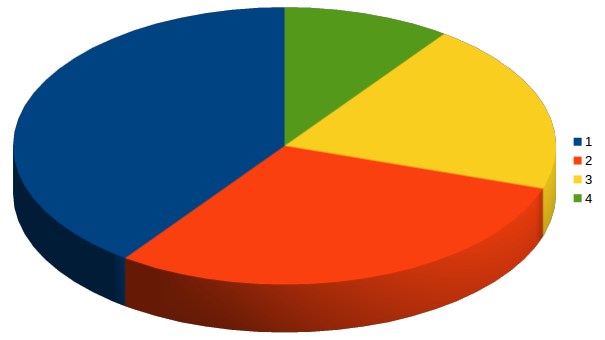

title: Optimisation des déploiements de war
author:
  name: Adrien Sales
output: index.html
controls: true
theme: sudodoki/reveal-cleaver-theme
--

 Déploiements


 Le choc de simplification

--

### Philosophie

* Proposer des sources d'améliorations opérationelles en continu
* Les mettre en oeuvre
* En mesurer les effets

--

### Constat

* Procédures non partagées
* Méthode de déploiements basée sur des tickets passés vs. une méthode centralisée
* Processus non maîtrisé par tous (fonctionnement d'un Tomcat, du cluster)

--

### Objectifs

* Garantir la compréhension, l'uniformité et le respect du protocole
* Analyser les performances de l'existant
* Améliorer le protocole

--

### Prérequis

* Disponibilité (négociée) des acteurs
* Légitimité des leaders/référents
* Respect des engagements

--

### Prérequis : Rôles : leader

Adrien


* Leader du projet
* Vision de la trajectoire
* Insuffle la philosophie DevOps (organisation, outils)
* Challenge les parties prenantes sur une montée en compétences
progressive, valorisée en continu
* Anime l'équipe


--

### Prérequis : Rôles : Leader Infra 

Thibaut

* Participe à la conception de nouvelles méthodes
* Met en oeuvre des solutions
* Garantit la bonne application des procédures


--

### Prérequis : Rôles : Equipe

Devs & Ops

* Pas de distingo prestataire/agent mairie
* Application éclairée des procédures développées
* Ouverture d'esprit sur l'innovation
* Nécessité et volonté de comprendre ce qui est fait et pourquoi
* Reconnaissance des rôles

--

### Code de conduite 1/2

* Comprendre et maîtriser ce qui est fait et pourquoi
* Utiliser les logiciels au mieux et ce pour quoi ils ont été conçus
* Pas de clic : script, pour tout
* Développer sous linux (pas de "rebond" sur Windows)

--

### Code de conduite 2/2

* Versionner, tout, toujours, tout le temps
* Faire les choses en continu
* Pas de mail, mais des tickets
* S'appuyer sur des indicateurs communs
* "Pair deploying Dev&Ops" : sessions sur un même environnement de travail


--

## Startup !

On considère ici que :

* Les deux leaders ont légitimité
* L'équipe est impliquée

Sans cela, le chantier s'arrête là.

--


--

### Etape 1 : war only

* Action très simple et atomique
* Facilement documentable
* Très bon point de départ pour comprendre le fonctionnement d'un Tomcat
* Gros potentiel d'optimisation à moindre frais
* Ouvre la porte vers des pratiques DevOps

--

### KPI

<i>"A Key Performance Indicator is a measurable value that demonstrates
how effectively a company is achieving key business objectives."</i>

<i>"Organizations use KPIs at multiple levels to evaluate their success at reaching targets."</i>


--

### KPI

* Construction des KPI : détail et complexité de la construction
* Pose des KPI
* Analyse des KPI
* Amélioration de la production de ces KPI (facilité, précision, transparence, opportunités, ...)

--

### Construction des KPIs

Création d'une table (psql) afin de produire les indicateurs.

```
CREATE TABLE deploy_war_only  ( 
    id             int4 NULL,
    prio           varchar NULL,
    assignee       varchar NULL,
    temps          numeric NULL,
    application    varchar NULL,
    aggreg_time    int4 NULL
    )
```

--

### Chargement du rapport redmine (csv)

```
copy deploy_war_only from '/tmp/issues.csv' DELIMITER ';' CSV;
```

--

### Tranches de temps

aggreg_time

* 4 : strictement supérieur à une heure
* 3 : strictement supérieur à 30 ' mais inférieur à 1h
* 2 : entre 15' et 30 '
* 1 : moins de 15' (la cible)


--

### Tranches de temps

Mise à jour de la table :

```
update deploy_war_only
set aggreg_time=4 where (temps > 1);
update deploy_war_only
    set aggreg_time=3 where (temps > 0.5 and temps <= 1);
update deploy_war_only
    set aggreg_time=2 where (temps > 0.25 and temps <= 0.5);
update deploy_war_only
    set aggreg_time=1 where (temps <= 0.25)
```

--

### Famille d'applications

Créer des familles d'application pour mieux comprendre où part le temps :

```
ALTER TABLE deploy_war_only
    ADD COLUMN project_family varchar(25) NULL;

update deploy_war_only
    set project_family = application;
update deploy_war_only
    set project_family = 'SIRH'
    where application like 'SIRH%';
```

--

### KPI-01 : Les plus gros déployeurs

Personnes qui ont fait le plus de déploiements war-only à ce jour

```
select assignee "Agent", count(*) "Nb. Déploiements"
from deploy_war_only
group by assignee
order by count(*) desc
```

```
Baptiste Jammet        292
bruno quinquis         272
ioana draghici         150
Thibaut De Casabianca  75
alexandre FAULLE       43
```

--

### KPI-01 : Volume total de déploiement /agent


--

### KPI-02 : Distribution des temps de déploiement

```
select aggreg_time, count(aggreg_time)
from deploy_war_only
group by aggreg_time
order by aggreg_time desc
```

```
aggreg_time count
4             25
3             72
2             453
1             322
```

--

### KPI-02 : Distribution des temps de déploiement



--

### KPI-03 : Distribution des temps/appli

```
select application, aggreg_time, count(aggreg_time)
from deploy_war_only
group by application, aggreg_time
having count(*) > 10
order by application desc, count(*) desc
```


```
application     nb2     nb1
SI.RH           298     172
SEAT             14      16
Organigramme     17       0
Missions SIALE    0      15
Annuaire          0      11
ADVERAD           0      12
Actes Etat Cicil  0      12
```


--

### KPI-03 : Aggrégat par appli (SIRH aggrégé)


--

### Pertinence des KPI

Réactions face à ces KPI

--

### Premiers retours sur la constitution des KPIs

* Long à mettre en oeuvre
* Ne se met pas à jour en continu
* N'a jamais été produit sous cette forme
* Très enrichissant et saisissant
* Possibilité de poser des métriques de référence (baseline)

--

### Prérequis pour la production des KPIs

Création d'un univers BI pointant sur Redmine permettant de produire et de
suivre ces métriques en continu

--

### De la mesure à la stratégie

Traduire les KPI en stratégies.


--

### Stratégies

* Uniformisation des performances des agents
* Réduction du temps passé/déploiement
* Travail autour des gros consommateurs (diminution du nb. de déploiements, refonte de code, ...)
* ...

--

## Objectif 1.0 : Uniformisation

Pour tous, les mêmes :

* pratiques
* performances

--

### Constat : distribution du temps/agent


--

### Explications

* On réserve les plus chauds à certains
* Certains ont une méthode personnelle pour déployer, plus efficace
* Certains ne notent pas le temps redmine de la même manière
* ...

--

### Etablir un étalon

Avant de changer quoi que ce soit, nous avons besoin d'une
granularité plus fine sur la distribution du temps passé au sein d'un même
déploiement, sur un projet fixé.

Ce sera notre étalon.

--

### Métriques au sein d'un déploiement

* Récup/download d'un war
* Temps de copie vers le tomcat
* Test reverse proxy
* Test appli up
* Suppression de l'ancien war

--

### Application war étalon

Commencer par une appli simple (pas SI.RH) : Appock/Shinigami ?


--

### Exemple de métrique sur un déploiement

appock :

```
Actions                   Temps (minutes)
Download du war           8
Upload du war tu Tomcat   2
Test(s) reverse proxy     2
Test Appli Up             3
Suppression ancien war    5
```

--

### Métriques types


--

### Actuellement : Performances disparates


--
## Objectif 1.0 : uniformité


--


### Objectifs 2.x

Améliorer par itération les métriques d'un déploiement.


* 2.0 : download du war
* 2.1 : copie vers le tomcat
* 2.2 : Test reverse proxy
* 2.3 : Test appli up
* ...

--

### Roadmap 2.x

La Roadmap des objectifs 2.x sera définie grâce aux KPIs
de performances remontés sur le déploiement étalon.

--

### Objectif 2.0


--
### Objectif 2.1


--
### Exemple de Progression partagée


--

### La suite

* Les besoins d'amélioration vont émerger de l'équipe
* Généralisation de ce cycle (KPI, Analyse, Amélioration et Stabilisation) à tous les types de déploiements
* La dynamique DevOps est lancée

--


